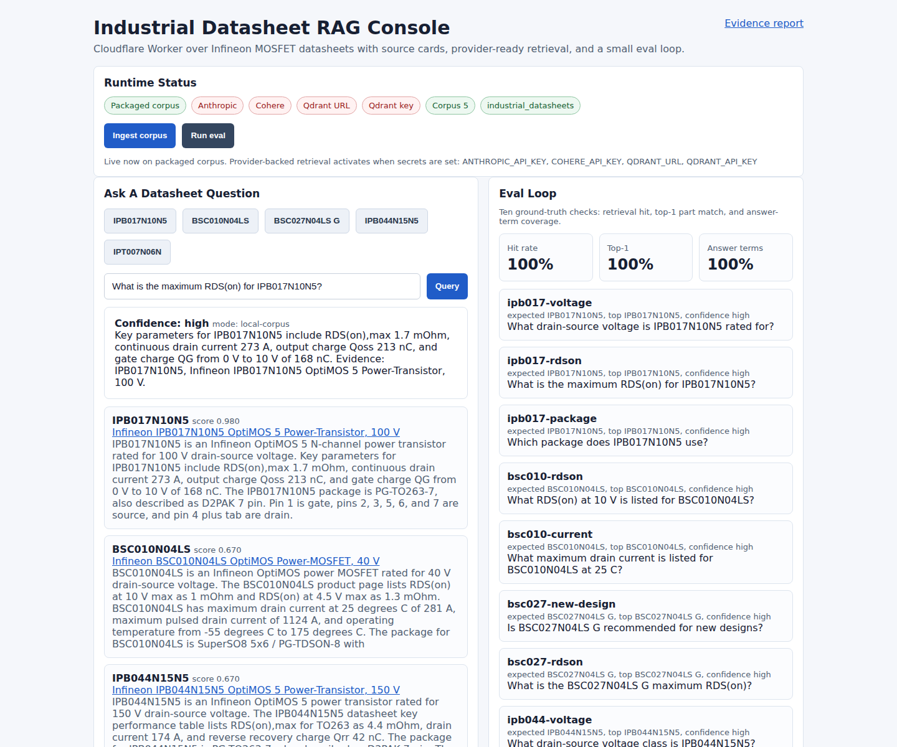

# Industrial Datasheet RAG

Source-grounded RAG for industrial datasheets on Cloudflare Workers. Hono serves both the HTML console and JSON API. Qdrant Cloud Inference handles embedding during upsert/query, so no separate embedding provider key is required. Anthropic generation is optional.

## Current Proof

- Live Worker: https://industrial-doc-rag.mariusdeving.workers.dev
- Repo: https://github.com/mj-deving/industrial-doc-rag
- Runtime mode: `qdrant-inference`
- Vector collection: `industrial_datasheets`
- Inference model: `sentence-transformers/all-minilm-l6-v2`
- Eval, last checked 2026-05-14: `hitRate 1.0`, `top1Accuracy 1.0`, `answerTermAccuracy 1.0`



## What This Proves

- The Worker is deployed and serves a real operator console from the same runtime as the API.
- Qdrant Cloud Inference is active for retrieval; `/health` reports Qdrant URL/key configured without exposing secret values.
- `/query` returns structured JSON: answer, confidence, sources, excerpts, scores, and raw retrievals.
- `/eval` runs ten fixed ground-truth checks against the current retrieval path.
- Source cards link back to public Infineon datasheets, so answers can be inspected instead of trusted blindly.

## Architecture

- `POST /ingest` accepts a public PDF URL. With Qdrant secrets it stores chunks using Qdrant Cloud Inference; without Qdrant secrets it reports packaged-corpus readiness.
- `POST /ingest/corpus` upserts the packaged five-datasheet corpus into Qdrant.
- `POST /query` retrieves top-5 chunks from Qdrant when configured, applies a narrow part-number rerank, and returns structured JSON with source cards.
- `GET /eval` runs ten ground-truth Q&A cases and reports hit rate, top-1 accuracy, and answer-term coverage.
- `GET /health` reports runtime readiness without leaking configured secret values.
- `GET /` and `GET /console` serve the operator console from the same Worker.

## Tradeoffs

- **Hono on Workers, not FastAPI:** the deployment target is the Worker itself. Workers remove server management and keep the route surface small enough to inspect quickly.
- **Qdrant Cloud Inference:** Qdrant generates embeddings during upsert and query using `sentence-transformers/all-minilm-l6-v2`. This keeps the public deployment to one retrieval provider instead of adding a second embedding vendor.
- **Optional Haiku-class generation:** if `ANTHROPIC_API_KEY` is configured, the Worker uses `claude-haiku-4-5-20251001` over retrieved snippets. Without Anthropic, it returns extractive source-grounded answers.
- **Packaged-corpus fallback:** the public Worker must remain usable when provider credentials are absent or being rotated. The fallback uses the same curated corpus facts and returns source-grounded extractive answers.
- **Dense top-5 plus identifier rerank:** Qdrant supplies semantic recall. A narrow part-number boost handles the industrial reality that exact component IDs should beat semantically similar neighbors.
- **PDF extraction:** Workers cannot run the common Node PDF parser stack cleanly. The code first attempts lightweight PDF text extraction. For the five known Infineon PDFs it falls back to curated datasheet chunks after validating that the PDF URL is reachable. Table-aware PDF parsing is the correct next investment.
- **Eval loop:** ten fixed Q&A pairs are not a benchmark claim. They are a regression tripwire for retrieval wiring, top-1 source quality, and answer-term coverage.

## Live API Examples

### `GET /health`

```json
{
  "ok": true,
  "providerReady": true,
  "mode": "qdrant-inference",
  "missingSecrets": [],
  "configured": {
    "anthropic": false,
    "qdrantUrl": true,
    "qdrantApiKey": true,
    "localCorpus": true
  },
  "inferenceModel": "sentence-transformers/all-minilm-l6-v2",
  "collection": "industrial_datasheets",
  "corpusCount": 5
}
```

### `POST /ingest/corpus`

```json
{
  "ingested": 5,
  "result": {
    "documentId": "packaged-corpus",
    "chunks": 5,
    "mode": "qdrant-inference"
  }
}
```

### `POST /query`

Request:

```json
{
  "question": "What is the maximum RDS(on) for IPB017N10N5?"
}
```

Response excerpt:

```json
{
  "answer": "Key parameters for IPB017N10N5 include RDS(on),max 1.7 mOhm, continuous drain current 273 A, output charge Qoss 213 nC, and gate charge QG from 0 V to 10 V of 168 nC. Evidence: IPB017N10N5, Infineon IPB017N10N5 OptiMOS 5 Power-Transistor, 100 V.",
  "confidence": "high",
  "mode": "qdrant-inference",
  "sources": [
    {
      "title": "Infineon IPB017N10N5 OptiMOS 5 Power-Transistor, 100 V",
      "sourceUrl": "https://www.infineon.com/assets/row/public/documents/24/49/infineon-ipb017n10n5-datasheet-en.pdf?fileId=5546d4624a75e5f1014ac4a981111eed",
      "partNumber": "IPB017N10N5",
      "score": 0.842366,
      "excerpt": "IPB017N10N5 is an Infineon OptiMOS 5 N-channel power transistor rated for 100 V drain-source voltage..."
    }
  ]
}
```

### `GET /eval`

```json
{
  "total": 10,
  "hitRate": 1,
  "top1Accuracy": 1,
  "answerTermAccuracy": 1
}
```

## Setup

```bash
bun install
cp .dev.vars.example .dev.vars
```

Fill `.dev.vars`:

```bash
ANTHROPIC_API_KEY=... # optional
ANTHROPIC_MODEL=claude-haiku-4-5-20251001
QDRANT_URL=https://your-qdrant-cluster
QDRANT_API_KEY=...
QDRANT_COLLECTION=industrial_datasheets
QDRANT_INFERENCE_MODEL=sentence-transformers/all-minilm-l6-v2
```

Run locally:

```bash
bun run typecheck
bun test
bunx wrangler dev
```

Open the operator console:

```bash
open http://localhost:8787/
```

Check runtime status:

```bash
curl -s http://localhost:8787/health | jq
curl -s http://localhost:8787/report | jq
```

Ingest the packaged corpus:

```bash
curl -X POST http://localhost:8787/ingest/corpus
```

Query:

```bash
curl -s http://localhost:8787/query \
  -H 'content-type: application/json' \
  -d '{"question":"What is the maximum RDS(on) for IPB017N10N5?"}' | jq
```

Eval:

```bash
curl -s http://localhost:8787/eval | jq
```

Deploy:

```bash
bunx wrangler secret put QDRANT_URL
bunx wrangler secret put QDRANT_API_KEY
bunx wrangler secret put QDRANT_COLLECTION
bunx wrangler secret put QDRANT_INFERENCE_MODEL
bunx wrangler secret put ANTHROPIC_API_KEY # optional
bunx wrangler secret put ANTHROPIC_MODEL
bunx wrangler deploy
```

## Corpus

The packaged corpus uses five public Infineon MOSFET datasheets:

- IPB017N10N5
- IPT007N06N
- BSC010N04LS
- BSC027N04LS G
- IPB044N15N5

## Known Limits

- PDF parsing is intentionally narrow. Known Infineon URLs are validated and then mapped to curated facts when lightweight extraction is insufficient.
- The current corpus has one compact chunk per datasheet. That is enough for the current eval loop, but table-aware chunking would be needed for larger manuals.
- Anthropic generation is optional and not required for the live proof. The live Worker currently proves Qdrant retrieval plus extractive source-grounded answers.
- Eval coverage is deliberately small. It catches retrieval regressions for this corpus; it does not claim broad datasheet QA accuracy.

## Reference Integration

`n8n-template.json` shows the reference workflow:

```text
Webhook -> POST /query -> Slack notification + Email notification
```

Use `LOOM_SCRIPT.md` for the recording flow.
