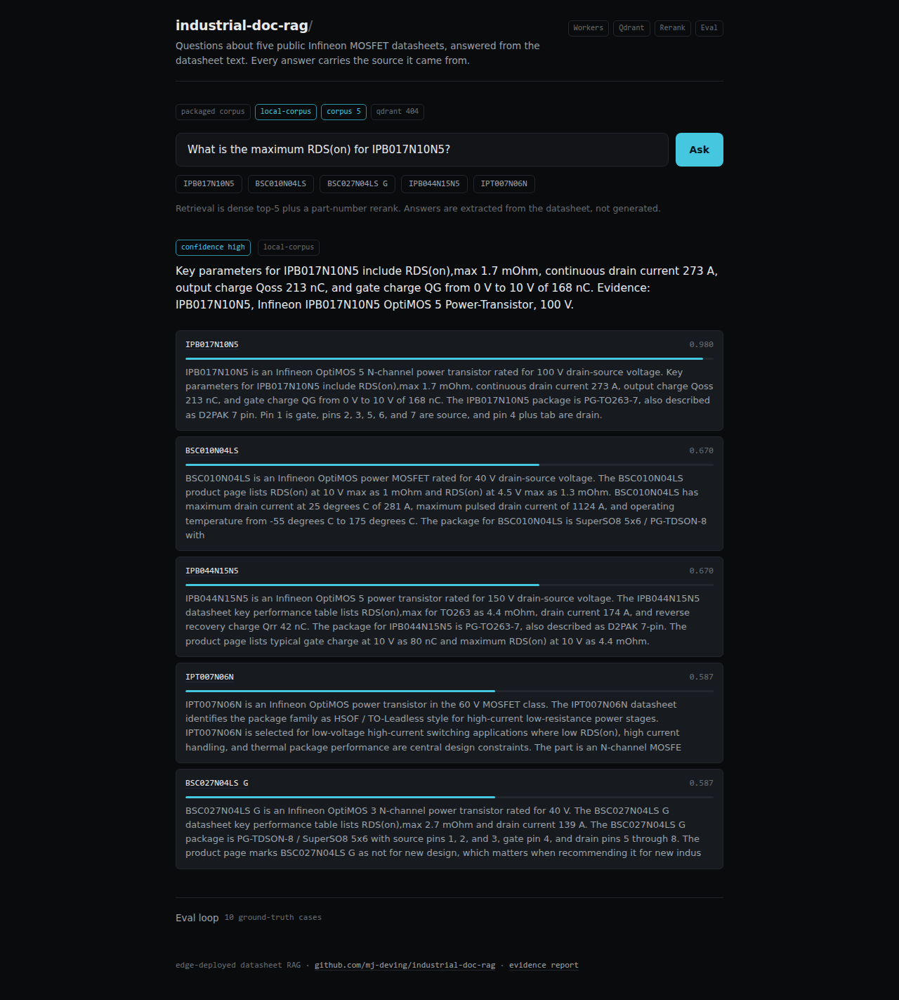
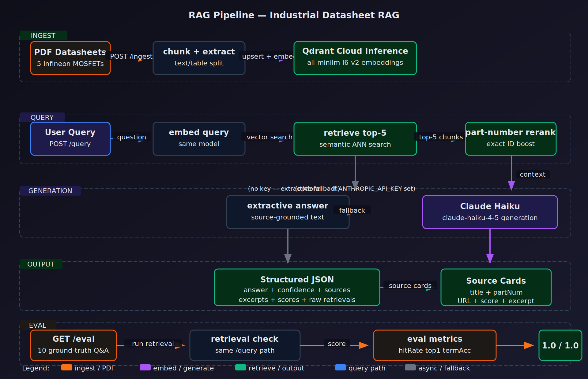

# industrial-doc-rag

Ask a question about five public Infineon MOSFET datasheets and get the answer together with the passage it came from. Runs on a Cloudflare Worker, no origin server.

**Live:** <https://industrial-doc-rag.mariusdeving.workers.dev> · **Stack:** Workers · Hono · Qdrant · part-number rerank · eval loop



## What it does

A question is embedded and the top five chunks come back from vector search. A part-number rerank then pushes exact matches (`IPB017N10N5`, `BSC010N04LS`) to the top, because in datasheet work the part number is most of the question. The answer is extracted from the retrieved text rather than generated, so every sentence traces to a passage you can open. Each source card carries its retrieval score.

Retrieval runs one of two ways. With a Qdrant Cloud cluster configured, embedding and search happen there (`all-minilm-l6-v2`, no separate embedding key needed). Without one, the same query runs against the corpus packaged in the repo. The Worker picks the path at query time and reports which one it used.

## Architecture



```
question
   |
   +-- embed + dense search (Qdrant Cloud Inference)  --\
   |                                                     >-- top 5 chunks
   +-- packaged-corpus search (in-repo, no secrets)   --/
                                                            |
                                                 part-number rerank
                                                            |
                                        extractive answer + scored source cards
                                                            |
                                          /query  /eval  /report  /health
```

Every box exists in `src/`. Nothing in this diagram is planned work.

## Verification

| What | Value | When |
|------|-------|------|
| Tests | 16 passing (`bun test`), typecheck clean | 2026-07-12 |
| Eval, 10 ground-truth cases | hit rate 100%, top-1 100%, answer terms 100% | 2026-07-12 |
| Deploy | version `83ebaa39-fba7-4ac5-8361-4d80ebb904b7` | 2026-07-12 |
| Effective retrieval path | `local-corpus` (the Qdrant cluster answers 404) | 2026-07-12 |

Reproduce it: `GET /eval` runs the ten cases live and returns the three numbers. `GET /health` says which path the next query will take, and it asks Qdrant to find out instead of just checking that a key is set.

## Limits

- **The Qdrant cluster currently answers 404**, so the demo runs on the packaged corpus. The Worker falls back at query time and reports the degrade in the interface, so the console still answers. The vector path, however, is not the one you are looking at right now.
- The corpus is five datasheets. A question about a sixth part has no answer, and the console says so instead of inventing one.
- Answers are extractive. Anthropic generation is wired but switched off; without a key there is no generated text.
- The eval checks retrieval hits and answer-term coverage. It does not check whether the datasheet value itself is correct.

## Run it locally

```bash
bun install
bun run dev     # console on localhost
bun test        # 16 tests
```

Without secrets everything runs on the packaged corpus. For the vector path, set `QDRANT_URL` and `QDRANT_API_KEY` as Worker secrets, then `POST /ingest/corpus`.

## License

MIT
